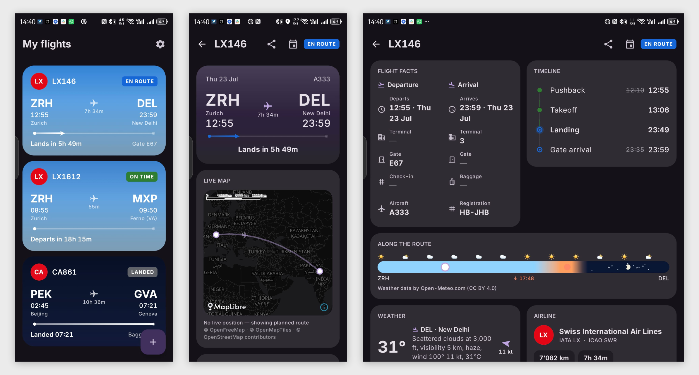

# Blipbird 🐦📡

A flight companion for Android.



[](https://github.com/L-K-M/Blipbird/actions/workflows/ci.yml)

**Source version:** v<!-- version -->1.1.1<!-- /version --> (no packaged GitHub Release is currently published)

> [!IMPORTANT]
> LLM Disclosure: Blipbird was built with substantial help from large language models.

Enter one or more flight
numbers (`CA861`, `CCA861`, `CCA861/CA861`, or paste a whole list) with an optional
date and a friendly name, and Blipbird shows a departure-board list of your
flights, a rich detail dossier with a live-updating route map, a **flight ribbon**
visualizing daylight/darkness and weather along the whole route, and sends
notifications for the moments that matter — delays, gate changes, departure,
landing, cancellation.

Open-source and ad-free, with no Blipbird account, backend, or analytics.

## Data sources (bring your own keys)

Blipbird composes free/BYO-key services — see `PLAN.md` §4 for the full strategy:

| Plane | Source | Key |
|---|---|---|
| Schedule/status/gates | [AeroDataBox](https://aerodatabox.com/) via RapidAPI (free tier ≈ 300 lookups/mo) | your RapidAPI key |
| Status fallback | [FlightAware AeroAPI](https://www.flightaware.com/commercial/aeroapi/) Personal ($5/mo usage waived; personal use) | your key |
| Live positions | [adsb.lol](https://adsb.lol) (ODbL) → airplanes.live → adsb.fi | none |
| Exact flown path (optional) | [OpenSky Network](https://opensky-network.org/) trajectory API | your API client — optional |
| Airport weather | [aviationweather.gov](https://aviationweather.gov/data/api/) METAR | none |
| Route weather | [Open-Meteo](https://open-meteo.com/) (CC BY 4.0, non-commercial) | none |
| Airports/airlines | bundled: OurAirports (PD) + mwgg/Airports tz (MIT) + OpenTravelData (CC BY 4.0) | — |

### Generating a key for FlightAware

1. Subscribe to the free tier
2. Go to your Account
3. Go to "Subscription"
4. Your key will be there

### Exact flown path via OpenSky (optional)

The free ADS-B aggregators only report where an aircraft is *right now*, so by
default the map shows the great-circle guide plus whatever live breadcrumbs the
app collected itself while you watched. If you want the line to follow the route
actually flown (holds, doglegs, the loop onto final), add an OpenSky Network API
client and Blipbird will backfill the full trajectory — live during the flight
and for completed flights up to OpenSky's 30-day archive limit.

This is **entirely optional**: every other feature works identically without it.

1. Create a free account at [opensky-network.org](https://opensky-network.org/)
2. In your account settings, create an **API client** (OAuth2 client
   credentials — OpenSky retired username/password API auth in 2025)
3. Paste the client ID and secret in **Settings → Data sources → Exact flown
   path (optional)**

OpenSky's API is for research and non-commercial use; your credentials stay
on-device (encrypted, excluded from backups) and are sent only to OpenSky.

**Without a status-provider key**, you can save flight numbers, use themes, and see
bundled airline information. Schedules, status, gates, and route endpoints require
a configured provider. Maps, airport details, weather, and live positions appear
only when the required route, time, or aircraft identifiers are available; they
are not guaranteed in zero-key mode. Paste keys in **Settings → Data sources**.

## Privacy & network access

Blipbird has no account system, Blipbird-operated backend, or analytics. Tracked
flight numbers, optional dates/aliases, and settings are stored locally, but may be
included in Android OS cloud backup or device transfer.

Network features connect directly to third parties. A configured flight-status
provider receives the flight identifier, optional date, and required credential.
A configured OpenSky API client (optional) sends OpenSky the aircraft's ICAO
address and your client credentials. ADS-B, aviation weather, Open-Meteo, and
OpenFreeMap hosts receive their respective queries and ordinary request metadata
such as the device IP address. See **Settings → About & data attribution** for
the providers in use.

## Building

```bash
./gradlew assembleDebug        # requires JDK 17+; Gradle 9.6.1 via wrapper
./gradlew testDebugUnitTest    # 60 unit tests
```

Helper scripts:

```bash
scripts/build.sh               # release APK staged into dist/ (--debug for debug)
scripts/install-debug.sh       # build debug APK + adb install on a connected phone
scripts/release.sh 0.2.0 --push # bump version, tag v0.2.0, push — CI publishes the release
```

Regenerate bundled reference data / icons:

```bash
python3 scripts/generate_reference_data.py   # writes app/src/main/assets/reference/ + lockfile
python3 scripts/generate_icons.py            # regenerates launcher mipmaps from media-sources/ (regular + fun variants)
```

## License & attribution

Code: see `LICENSE`. Data/attribution: displayed in-app under **Settings →
About**, including "Weather data by Open-Meteo.com" (CC BY 4.0), OurAirports
(public domain), mwgg/Airports (MIT), OpenTravelData (CC BY 4.0), adsb.lol
(ODbL), OpenSky Network (optional; research/non-commercial API terms),
the Inter font (SIL OFL 1.1),
commons-suncalc (Apache-2.0), great-circle math after Chris Veness (MIT),
terminator math after Leaflet.Terminator (MIT). Airline names and codes are
trademarks of their respective owners, used for identification only. All flight
data is informational — **not for navigation or operational use**.
